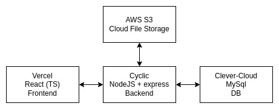

# 5days social
Мини-социальная есть, написанная за 5 дней по тестовому заданию.
## Архитектура приложения:
Архитектура зависит от поставленных условий: написание небольшого приложения за ограниченное время с быстрым развёртыванием на удалённых бесплатных хостингах. 
  **Архитектура**: 

 
## Стэк приложения
Стэк выбирался в приоритете опыта использования. По тестовому заданию необходимо было использовать React (TS). Было разрешено подключать библиотеки. 
- [Fronted](https://github.com/AllexKzk/mini-social-front-SYE): React (TS) | Host: [Vercel](https://vercel.com/) | [Visit](https://mini-social-front-sye.vercel.app)   
- - В качестве библиотеки стилей используется [MUI](https://mui.com/) как быстрое и удобное решение.
- [Backend](https://github.com/AllexKzk/mini-social-back-SYE): NodeJS + Express. | Host: [Cyclic](https://app.cyclic.sh/#/)   
- - Express позволяет быстро создать маршрутизацию на стороне сервера. А также имеет широкую поддержку у хостингов. *(В дальнейшем возможность грубо прописывать маршрутизацию привела к плохой масштабируемости. Особенно при работе с БД. Стоило потратить время на разработку гибких классов)*.
- - К сожалению [Cyclic не поддерживает SocketIO](https://docs.cyclic.sh/serverless/on-demand), поэтому реализовать поддержку сокетов в заданный временной промежуток не получилось. *(Решение: либо другой хостинг, либо другие библиотеки для облачных серверов).*
- - Так как Cyclic работает в read-only режиме, то в качестве хранилища статичных файлов используется [AWS S3](https://docs.cyclic.sh/concepts/storage).
- DB: MySQL | Host: [Clever-Cloud](https://console.clever-cloud.com/)
- - Ограничения: Максимальный размер: 10MB. Количество подключений: 5.
- - Небольшое количество подключений вызывает ряд неудобств: сбрасывая запросы, при заполненной очереди. *(Не исключено, что из-за ошибок разработчика. В течение пяти дней устранить эту проблему не получилось v_v)*
- - Архитектура БД:

## Showcase:

